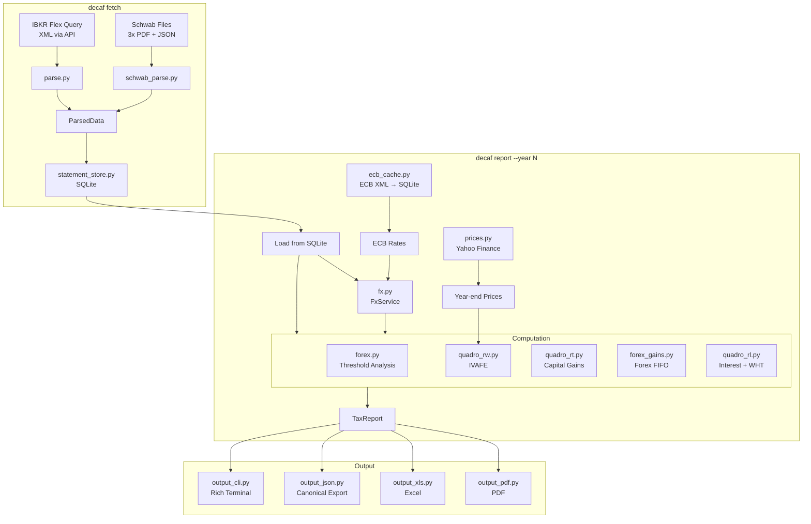
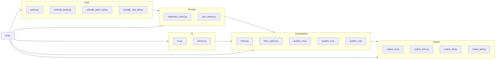

# Architecture

Engineering documentation for the decaf codebase. For tax law references,
see [NORMATIVA.md](NORMATIVA.md). For what to put in the dichiarazione,
see [GUIDA_FISCALE.md](GUIDA_FISCALE.md). For implementation gotchas,
see [INTERNALS.md](INTERNALS.md).

## Data Flow



## Module Boundaries



**Rule**: Computation modules never import from Output or CLI. Output modules
only import `TaxReport` from `models.py`. Input modules only import model
types. These boundaries are enforced by architecture tests.

## Key Design Decisions

| Decision | Rationale | Reference |
|----------|-----------|-----------|
| Trust broker FIFO for stock gains | IBKR `fifoPnlRealized` and Schwab Year-End Summary provide authoritative per-lot cost basis. Reimplementing FIFO would be error-prone and redundant. | [NORMATIVA.md#quadro-rt](NORMATIVA.md#quadro-rt--plusvalenze) |
| Compute forex FIFO ourselves | Neither broker provides forex P/L. IBKR EUR.USD trades have `broker_pnl_realized=0`. Schwab wire transfers aren't modeled as forex. | [NORMATIVA.md#forex-fifo-gains](NORMATIVA.md#forex-fifo-gains) |
| ECB rates primary | Italian tax law requires cambio BCE. IB rates used only for validation (flag >0.5% discrepancies). | [NORMATIVA.md#conversione-in-eur](NORMATIVA.md#quadro-rt--plusvalenze) |
| Per-lot IVAFE (not simplified) | Circolare 38/E requires per-lot reporting with pro-rata days. A simplified single-line approach underreports IVAFE. | [NORMATIVA.md#quadro-rw](NORMATIVA.md#quadro-rw--monitoraggio--ivafe) |
| LIFO for IBKR lot matching | Circolare 38/E par. 1.4.1 prescribes LIFO. Schwab provides exact lot matching via `date_acquired`. | [NORMATIVA.md#lifo](NORMATIVA.md#lifo-per-lot-matching-nel-quadro-rw) |
| Settlement dates for IVAFE, trade dates for RT | IVAFE counts holding days from settlement. Capital gains realized on trade date. | [INTERNALS.md](INTERNALS.md) |
| Decimal everywhere | Never float for money. Architecture tests enforce this. | `tests/test_architecture.py` |
| Cash deposits at 0.2% (not EUR 34.20) | Brokerage cash is a "deposito", not a "conto corrente". | [NORMATIVA.md#ivafe-formula](NORMATIVA.md#ivafe--formula) |

## Type System

All monetary amounts use `Decimal`. All dates use `datetime.date`.
Domain models are frozen dataclasses with `slots=True`.

**Enforced by architecture tests** (`tests/test_architecture.py`):
- No `typing.Any` anywhere in production code
- No bare `dict`, `list`, `tuple`, `set` without type parameters
- No `object` as function parameter type
- Every `sum()` over Decimal fields uses `Decimal(0)` start value
- `float()` only in logging calls and output serialization
- Every function has return type + parameter type annotations

**TypedDicts** for external data:
- `SchwabTransaction` — Schwab JSON export fields
- `_VestLotInfo` — internal lot tracking in schwab_parse
- `_OAuthTokens` — Schwab OAuth response
- `_TaxDetailBlock` — Annual Withholding PDF parsing

## FxService Architecture

```
FxService
  ._ecb: dict[(currency, date), Decimal]   # ECB rates (primary)
  ._ib:  dict[(currency, date), Decimal]    # IB rates (validation)

  .to_eur(amount, currency, date) -> Decimal
      1. Try ECB rate (fill-forward 5 days for weekends)
      2. If ECB unavailable, fall back to IB rate (with warning)
      3. If both unavailable, raise ValueError
      4. If both available, log warning if >0.5% discrepancy

  .ecb_rate(currency, date) -> Decimal | None
      Public accessor for specific ECB rate queries.
```

Currently only USD rates are loaded. The `(currency, date)` keying
supports multi-currency if GBP or CHF positions are added.

## Testing Strategy

| Layer | Tests | What | Source |
|-------|-------|------|--------|
| Unit | 128 | Individual modules (parsing, FX, forex, prices, holidays, store) | Synthetic data |
| Architecture | 11 | Type safety invariants via AST parsing | Production source |
| End-to-end | 72 | Full pipeline for 4 tax years against reference JSONs | Real broker data in `test_reference/` |
| Integration | `scripts/verify.sh` | Generate reports + diff against reference JSONs | Real broker data |

**Fixture databases** committed in `test_reference/`:
- `statements.db` — 163 trades, 86 cash txns, 19 positions
- `ecb_rates.db` — 1087 ECB rate days (2022-2026)
- `*_20{22,23,24,25}.json` — verified reference outputs

**Pre-commit hook** (`.githooks/pre-commit`) runs ruff + pyright + pytest
on every commit. Cannot be bypassed without `--no-verify`.

## CLI Pipeline

`cli.py:_cmd_report()` is the orchestrator. It runs sequentially:

1. **Load** from SQLite (all trades + all cash txns, no year filter)
2. **ECB rates** from cache (fetch if needed)
3. **Year-end prices** from Yahoo Finance (pinned exchange mapping in `prices.py`)
4. **Build FxService** (ECB primary, IB validation)
5. **Compute** forex threshold, RW (IVAFE), RT (gains), RL (income)
6. **Assemble** TaxReport
7. **Output** CLI + JSON + Excel + PDF

Steps 5-6 are pure computation with no I/O. Step 3 is the only
network call during report generation (and only for symbols held
at year-end).

## File Organization

```
src/decaf/
  models.py              Domain dataclasses (frozen, Decimal, typed)
  cli.py                 CLI entry point + orchestration
  parse.py               IBKR FlexQuery XML -> ParsedData
  schwab_parse.py        Schwab 3-file orchestrator -> ParsedData
  schwab_gains_pdf.py    Year-End Summary PDF parser
  schwab_vest_pdf.py     Annual Withholding PDF parser
  statement_store.py     SQLite storage (dedup, idempotent, multi-account)
  ecb_cache.py           ECB rate cache (async, aiosqlite)
  fx.py                  FX service (ECB primary, IB validation)
  prices.py              Year-end mark prices (yfinance)
  forex.py               Forex threshold analysis (daily balance)
  forex_gains.py         Forex FIFO gains (USD lot tracker)
  quadro_rw.py           IVAFE computation (per-lot, LIFO)
  quadro_rt.py           Capital gains (trust broker, ECB conversion)
  quadro_rl.py           Interest + WHT (income pairing)
  output_cli.py          Rich terminal tables (Italian)
  output_json.py         Canonical JSON export (all fields)
  output_xls.py          Excel workbook (Italian, one sheet per quadro)
  output_pdf.py          Professional PDF (Italian, landscape A4)
  holidays.py            Italian public holidays + business day check
  schwab_auth.py         OAuth2 (kept for future API use)
  schwab_client.py       Trader API client (kept for future API use)
```
