# Guida alla configurazione della Flex Query IBKR

Guida passo-passo per creare l'Activity Flex Query che decaf usa per generare la dichiarazione dei redditi italiana.

## Prerequisiti

- Un conto Interactive Brokers (IBKR Ireland o simili)
- Accesso al [Client Portal](https://portal.interactivebrokers.com/)

## Step 1: Creare una nuova Activity Flex Query

Entra nel Client Portal. Vai su **Performance & Reports** > **Flex Queries**. Clicca il pulsante **Create** (o **+**) vicino a **Activity Flex Query**.

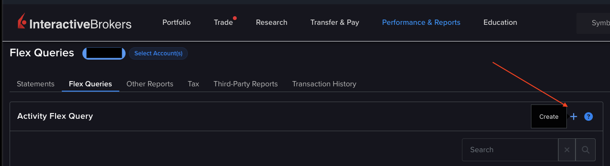

## Step 2: Nome della query

Inserisci un nome per la query. Nell'esempio usiamo `Italian Tax Report`, ma puoi chiamarla come preferisci.

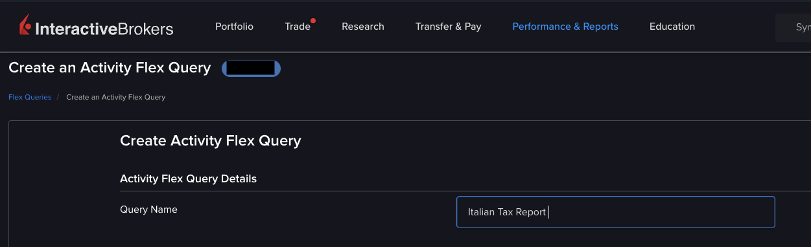

## Step 3: Configurazione delle sezioni

Vedrai una lista di sezioni collassabili. Cliccale per espanderle e seleziona i campi richiesti. Configurale esattamente come descritto qui sotto.

### Account Information

Seleziona tutti i campi. Forniscono i metadati del conto necessari al report.

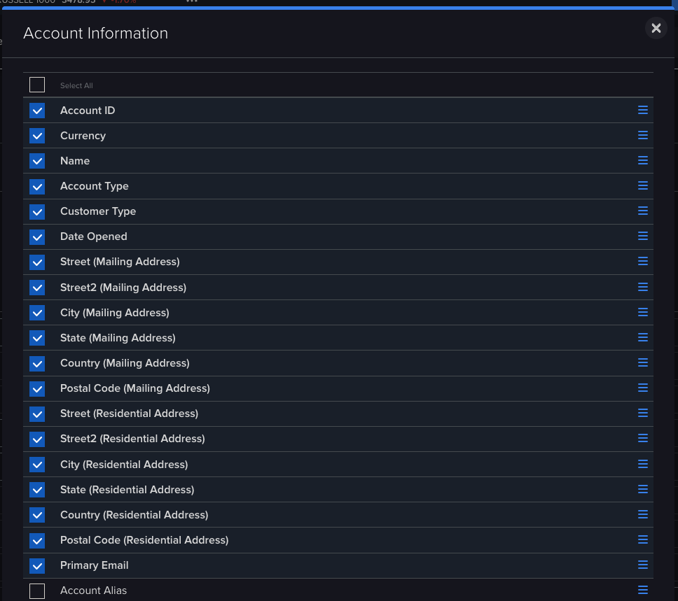

### Cash Report

**Options**: seleziona **Currency Breakout** (restituisce i saldi iniziali/finali per ciascuna valuta invece del solo riepilogo in valuta base).

**Fields**: Account ID, Currency, Starting Cash, Ending Cash.

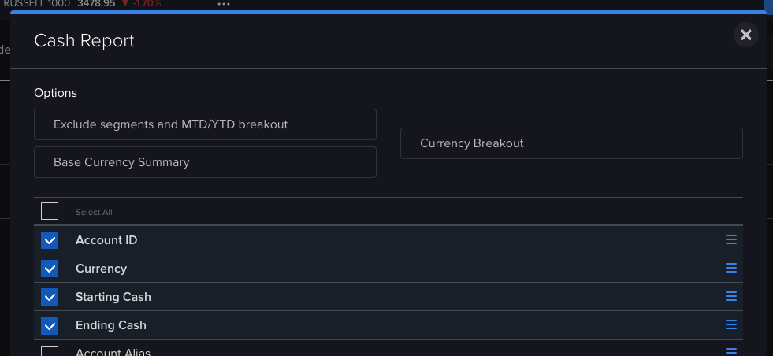

### Cash Transactions

**Options**: spunta TUTTI i tipi di transazione in entrambe le colonne (Dividends, Withholding Tax, Broker Interest Received, Deposits & Withdrawals, ecc.). Assicurati che sia selezionato **Detail**, non Summary.

**Fields**: Account ID, Currency, FXRateToBase, Type, Date/Time, Settle Date, Amount, Description.

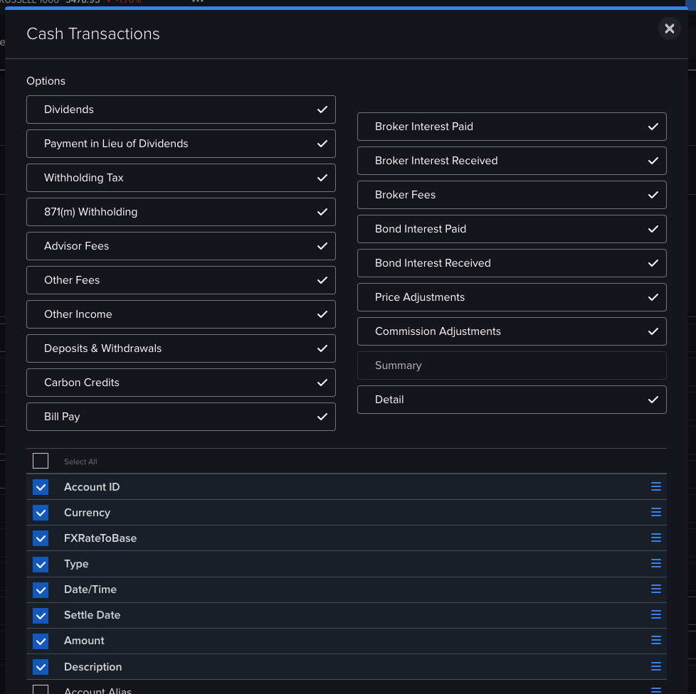

### Open Dividend Accruals

Nessuna opzione da impostare. Seleziona tutti i campi mostrati: Account ID, Currency, FXRateToBase, Symbol, ISIN, Ex Date, Pay Date, Gross Amount, Net Amount, Tax.

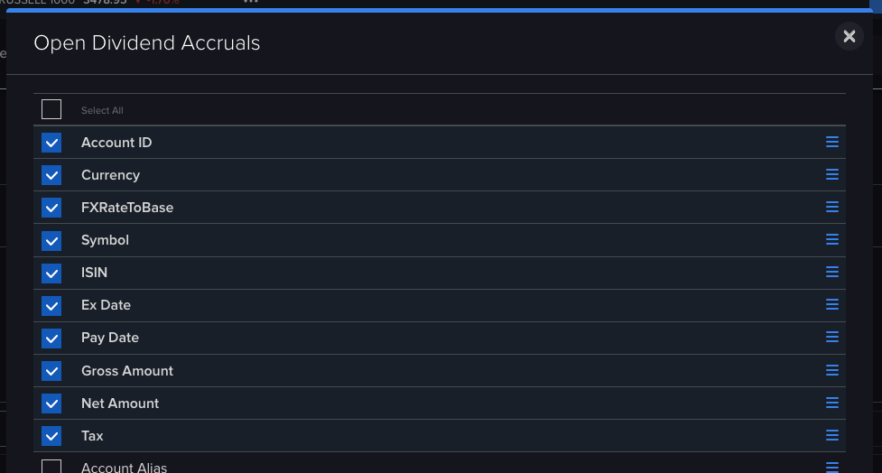

### Open Positions

> **IMPORTANTE**: seleziona la modalita' **Lot**, NON Summary. E' fondamentale. La modalita' Lot fornisce le date di acquisizione per ciascun lotto (`openDateTime`), necessarie per il pro-rata giorni dell'IVAFE. La modalita' Summary restituisce date vuote e il report risultera' errato.

**Options**: seleziona **Lot** (la spunta deve essere su Lot, non su Summary).

**Fields**: Account ID, Currency, FXRateToBase, Asset Class, Symbol, ISIN, Description, Quantity, Mark Price, Position Value, Cost Basis Money, Open Date Time.

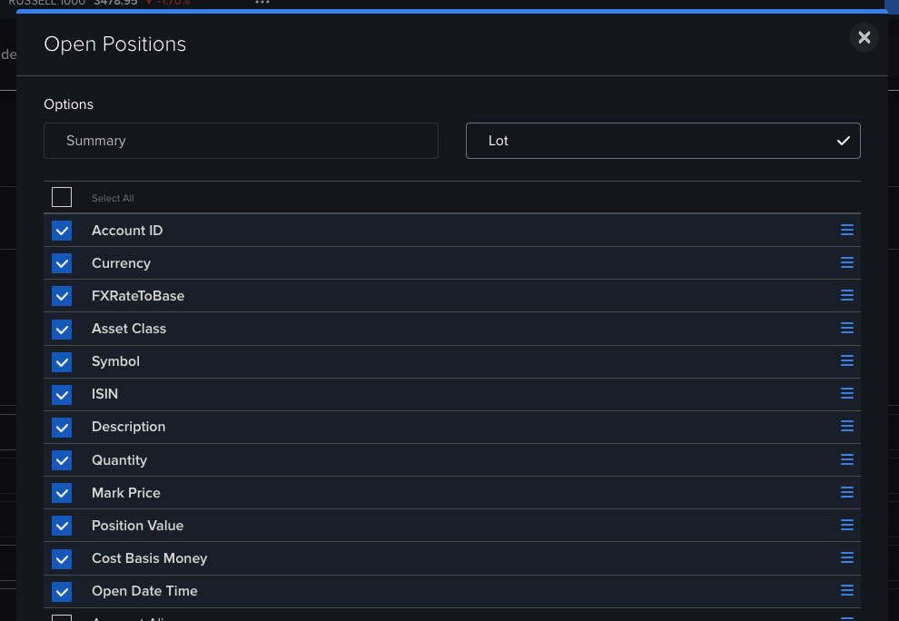

### Trades

**Options**: seleziona **Execution** *e* **Closed Lots**. Non spuntare Symbol Summary, Asset Class (option), Order, ne' Wash Sales.

> **Perche' Closed Lots e' obbligatorio**: per l'art. 9 c. 2 TUIR decaf converte il costo al cambio BCE della data di acquisto del lotto e il corrispettivo al cambio BCE della data di regolamento della vendita. Senza Closed Lots ogni SELL riporta la data di vendita anche come data di acquisizione, e la plusvalenza viene convertita con un unico tasso — un'approssimazione, non quanto richiesto dall'Agenzia. Schwab espone gia' le date di acquisizione per-lotto nello Year-End Summary; abilitando Closed Lots su IBKR i due broker finiscono allineati.

**Fields**: Account ID, Currency, FXRateToBase, Asset Class, Symbol, ISIN, Description, Date/Time, Settle Date Target, Buy/Sell, Quantity, TradePrice, Proceeds, IB Commission, IB Commission Currency, Cost Basis, Realized P/L, Listing Exchange.

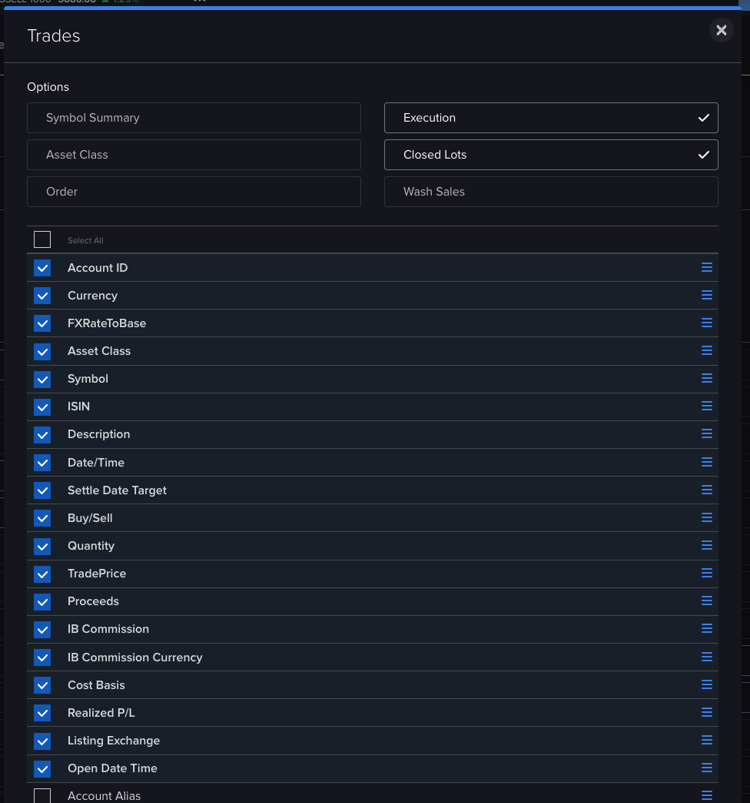

IB applica la stessa lista di campi sia alle righe Execution sia ai Closed Lot figli — ciascun `<Lot>` sotto un `<Trade>` SELL emette il proprio `openDateTime`, `cost`, `proceeds`, `quantity`, `fifoPnlRealized`. Il parser di decaf appiattisce queste strutture in una riga Trade per lotto, in modo che ogni riga RT abbia la sua conversione BCE per-lotto.

## Step 4: Delivery e General Configuration

Scorri fino alle sezioni Delivery e General Configuration. Impostale come segue:

| Impostazione | Valore |
|--------------|--------|
| **Format** | **XML** |
| **Period** | **Last 365 Calendar Days** |
| Profit and Loss | Default |
| Include Canceled Trades? | No |
| **Include Currency Rates?** | **Yes** |
| **Include Audit Trail Fields?** | **Yes** |
| Display Account Alias in Place of Account ID? | No |
| Breakout by Day? | No |
| **Date Format** | **yyyyMMdd** |
| **Time Format** | **HHmmss** |
| **Date/Time Separator** | **; (semi-colon)** |

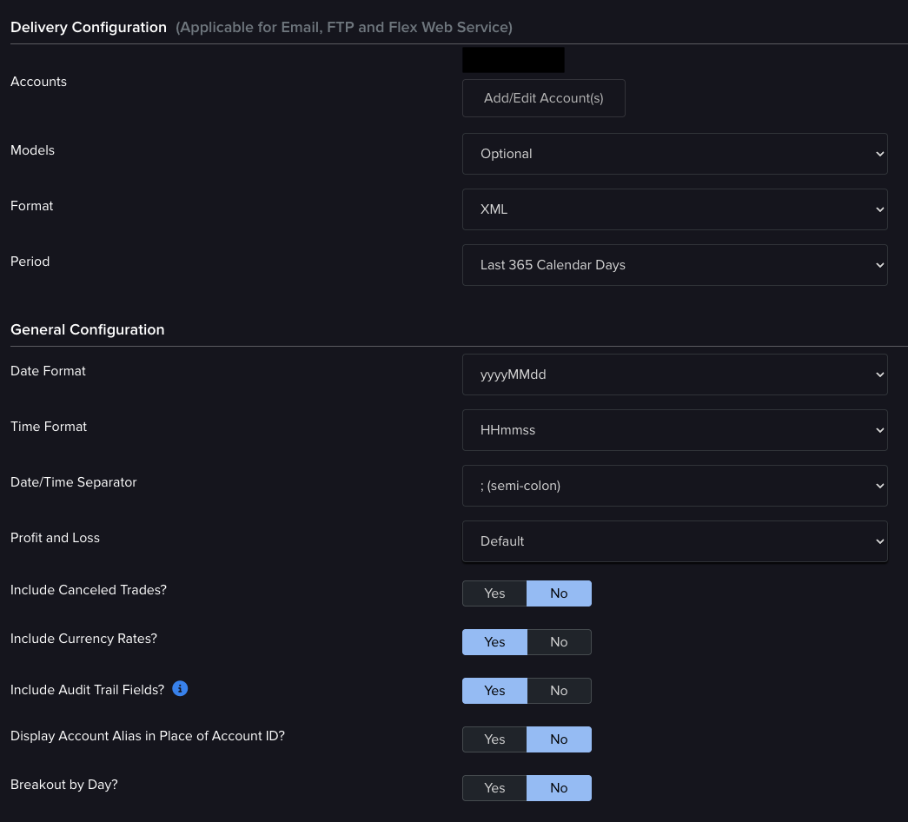

## Step 5: Revisione e salvataggio

Controlla la sezione Delivery e General Configuration per verificare che formato, periodo, formato data/ora e il flag sui tassi di cambio corrispondano alla tabella dello Step 4. Il riepilogo completo dei campi non e' riportato qui — e' una lista lunga e difficile da riscontrare a colpo d'occhio; fidati degli screenshot per-sezione qui sopra.

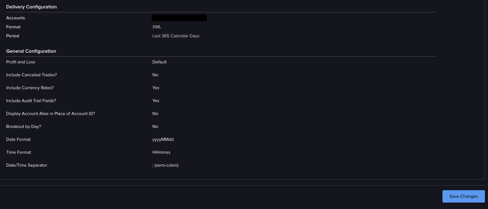

Clicca **Save Changes**. Dovresti vedere la schermata di conferma:

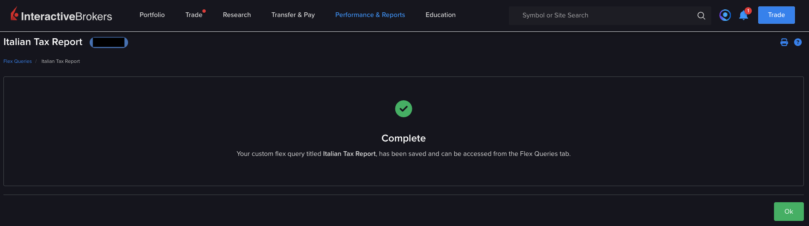

## Step 6: Ottenere Token e Query ID

1. Torna su **Performance & Reports** > **Flex Queries**
2. La nuova query compare nella lista con un **Query ID** (un numero tipo `1423221`)
3. Vai su **Flex Web Service Configuration** (in fondo alla pagina Flex Queries)
4. Attiva il servizio e genera un **Token**
5. Imposta entrambi nel tuo file `.env`:

```bash
IBKR_TOKEN=il_tuo_token
IBKR_QUERY_ID=il_tuo_query_id
```

In alternativa passali via flag CLI, o inseriscili interattivamente quando decaf te li chiede.

## Mapping dei nomi dei campi

IB usa nomi diversi nella schermata di selezione, nel riepilogo di review e nell'output XML. Questa tabella mappa tutti e tre per i campi con nomi differenti:

| Schermata di selezione | Review Summary | Attributo XML |
|---|---|---|
| Account ID | ClientAccountID | `accountId` |
| Currency | CurrencyPrimary | `currency` |
| Asset Class | AssetClass | `assetCategory` |
| Cost Basis | CostBasis | `cost` |
| Realized P/L | FifoPnlRealized | `fifoPnlRealized` |
| Date/Time | DateTime | `dateTime` |
| Settle Date Target | SettleDateTarget | `settleDateTarget` |
| Buy/Sell | Buy/Sell | `buySell` |
| FXRateToBase | FXRateToBase | `fxRateToBase` |
| Open Date Time | OpenDateTime | `openDateTime` |
| Quantity (Positions) | Quantity | `position` |
